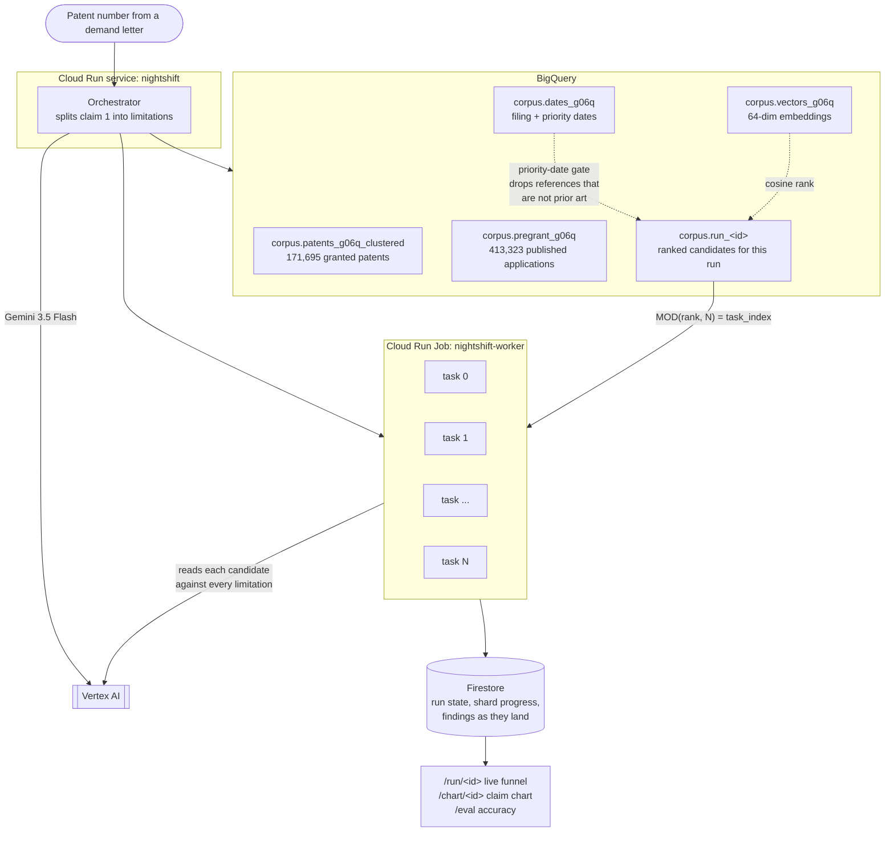

# Architecture

Nightshift is a background job, not a request/response service. One request starts
it, many Cloud Run tasks execute it, and a browser watches it from outside. The
shape of the system follows from that, and from one measured constraint.

## The constraint that decided the design

Querying the public patents tables per request is not survivable. Measured by dry
run, not estimated:

| Query against `patents-public-data` | Scan |
|---|---|
| One `description` lookup | **1,052 GB** |
| One `claims` lookup | 117 GB |
| One target fetch joining `patentsview.claim` | 40 GB |

Those tables are neither partitioned nor clustered on patent id, so a `WHERE`
filter still reads the whole column. So the corpus is materialized once into a
clustered table and every later read hits that instead.

| | Before | After |
|---|---|---|
| One target fetch | 40.16 GB | **0.20 GB** |

About 200x, from two changes: moving off the public tables, then clustering on
`patent_id`. Both are measured in `docs/DAY1-FINDINGS.md`.

## Flow



## Why each piece is there

**BigQuery** holds the corpus and does the ranking. The embedding prefilter is a
cosine rank over 171,695 stored vectors, which is a database operation, not a
model operation.

**Vertex AI** runs `gemini-3.5-flash`. It is the engine, not an advisor: the
model decides which references are material and produces the limitation-by-
limitation mapping. Vertex rather than the AI Studio endpoint because the free
tier caps some models at 20 requests per day, which backoff cannot recover from
when the unit of work is thousands of candidates.

**Cloud Run Jobs** execute the fan-out. Tasks receive `CLOUD_RUN_TASK_INDEX` and
`CLOUD_RUN_TASK_COUNT` and nothing else, so the shard boundary is derived from
the index alone. The orchestrator materializes the ranked candidates once and
each task reads `MOD(rank, task_count) = task_index`. Running retrieval inside
every task is the obvious design and the wrong one: it multiplies a 1.3 GB scan
by the worker count and buys nothing.

**Firestore** is where the three parties meet. The job is started by one request,
executed by tasks that never talk to each other, and watched by a browser that
may connect long after the work began. Findings are written the moment they are
found, so a task that dies does not take its results with it.

## The funnel

Every number below is produced by the system, and the same numbers appear on
`/run/{id}` while a run is in flight.

```
171,723   corpus
          |  priority-date gate: a reference must predate the
          |  target's earliest priority date. 52.8% of corpus
          |  patents claim priority earlier than their own filing
          |  date, so grant date is wrong for over half of them.
 -158,867  not prior art
          |  family exclusion: shared title or shared priority date
  12,856  eligible
          |  cosine rank over 64-dim stored embeddings
   2,000  read by Gemini, one call per candidate
          |  materiality screen
     ~40  material
          |  limitation-by-limitation mapping
      10  charted
```

Numbers shown are an actual run against US 10,002,398.

## The one number that explains the shape

Ranking this corpus with `gemini-embedding-001`, the strongest embedding
available, **a top-50 shortlist still misses 59.7% of the references a USPTO
examiner actually applied to anticipate a claim.**

| Depth read | Anticipation references found |
|---|---|
| Top 20 | 26.6% |
| Top 50 | 40.3% |
| Top 100 | 48.4% |
| Top 500 | 71.0% |
| Top 2,000 | 83.9% |

That is the whole reason the fan-out exists. Every commercial patent tool ranks a
corpus and shows a person the top few dozen results, and no amount of ranking
quality rescues that design: these figures are already measured on the better
embedding. Reading two thousand references is not something a person does, which
is why it is a background job across ten Cloud Run tasks rather than a search box.
